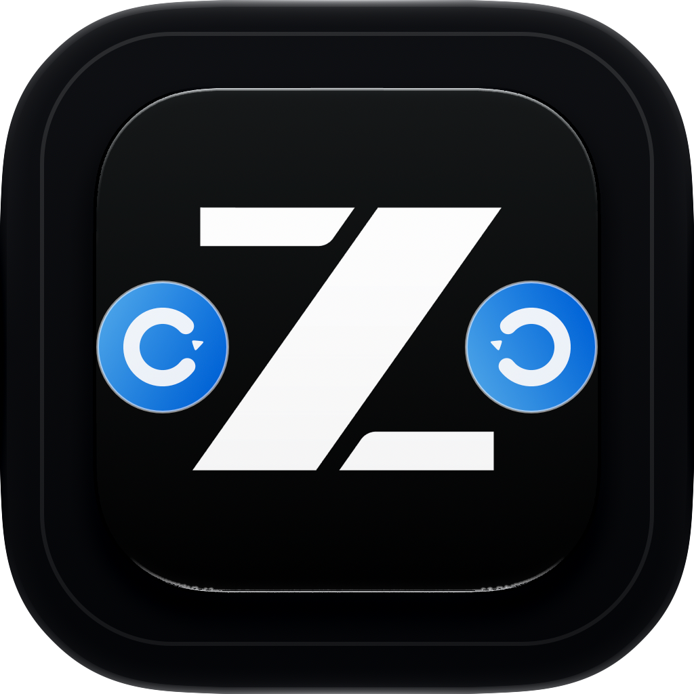
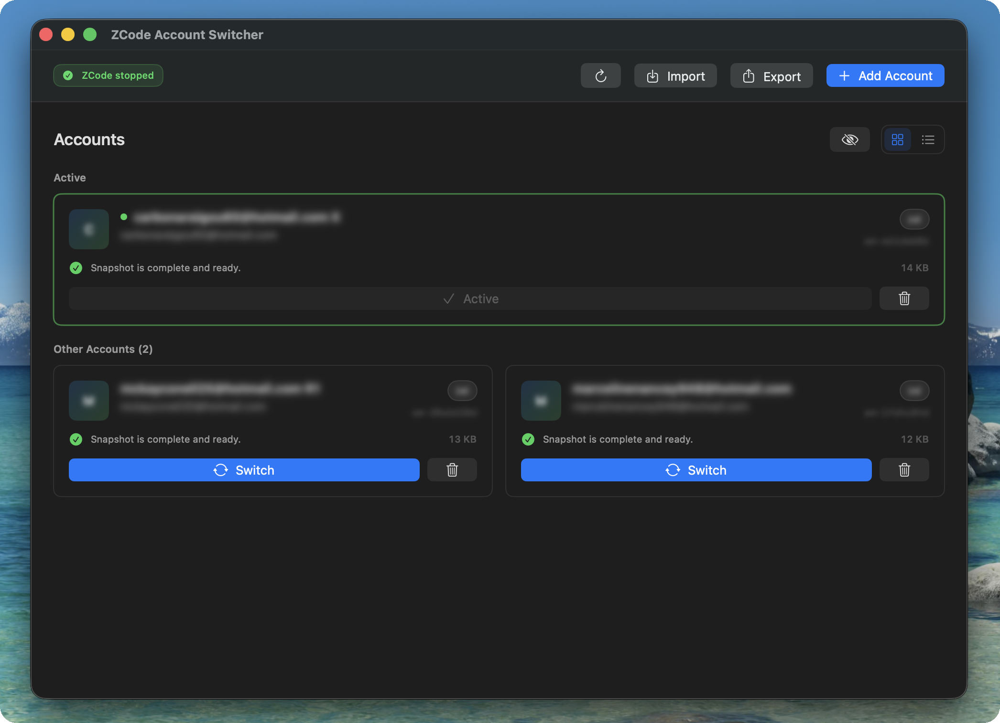

<p align="center">
  
</p>

<h1 align="center">ZCode Account Switcher for macOS</h1>

<p align="center">
  <a href="https://github.com/FedyaLight/zcode-account-switcher/actions/workflows/ci.yml"></a>
  <a href="https://github.com/FedyaLight/zcode-account-switcher/releases"></a>
  <a href="LICENSE"></a>
</p>

<p align="center">
  <a href="https://fedyalight.github.io/zcode-account-switcher/">Website</a> ·
  <a href="https://github.com/FedyaLight/zcode-account-switcher/releases/latest">Download for macOS</a>
</p>

A small native macOS app for switching between local ZCode account snapshots.

The app saves the current ZCode login state, lets you keep several local account
snapshots, and swaps the active snapshot back into ZCode when you switch
accounts. It is intentionally macOS-only and built with SwiftUI, SwiftPM, and
XcodeGen.

<p align="center">
  
</p>

## What It Does

- Captures the current ZCode login files as a local account snapshot.
- Lists saved accounts with basic health information.
- Switches accounts by closing ZCode, backing up the current state, replacing the
  login files atomically, and relaunching ZCode.
- Supports OAuth-based account capture and local import/export.
- Blurs private account details in the UI when privacy mode is enabled.

## Important Data Notes

Account snapshots contain login tokens. Treat them like credentials.

The app reads and writes these ZCode files:

- `~/.zcode/v2/credentials.json`
- `~/.zcode/v2/config.json`
- `~/.zcode/v2/setting.json`
- `~/.zcode/v2/coding-plan-cache.json`

Saved snapshots and switch backups are stored under:

- `~/Library/Application Support/ZCode Account Switcher/accounts`
- `~/Library/Application Support/ZCode Account Switcher/.last`

Do not publish `accounts/`, `.last/`, exported account files, logs, or local
environment files.

## Install From A Release

1. Download the `.dmg` from the release.
2. Open the DMG.
3. Drag `ZCode Account Switcher.app` to `Applications`.
4. Launch the app from `Applications`.

Current local release builds are ad-hoc signed, not Apple-notarized. If macOS
blocks a build that you trust, the DMG includes a helper named
`Run to Remove Quarantine.command`. Run it after dragging the app to
`Applications`.

The helper runs the same command you can run manually:

```sh
xattr -dr com.apple.quarantine "/Applications/ZCode Account Switcher.app"
open "/Applications/ZCode Account Switcher.app"
```

This removes quarantine metadata from that installed app bundle recursively.
It persists for that copy of the app. If you replace the app with a newly
downloaded non-notarized build, run the helper again for the new copy.

Use the `xattr` command only for builds you downloaded from a trusted release
page or built yourself.

## Build From Source

Requirements:

- macOS 13 or newer
- Xcode command line tools
- Swift 5.9 or newer
- XcodeGen, for regenerating the Xcode project

Run the tests:

```sh
swift test
xcodegen generate
xcodebuild test \
  -project ZCodeAccountSwitcher.xcodeproj \
  -scheme ZCodeAccountSwitcher \
  -destination 'platform=macOS'
```

Build and launch a local debug app:

```sh
./script/build_and_run.sh
```

Create a release DMG:

```sh
./script/package_release.sh
```

Release artifacts are written to `dist/`. The DMG uses a plain Finder layout
with the app, the `Applications` shortcut, and the optional quarantine helper
for unsigned builds.

Generate the Sparkle appcast for the release DMG:

```sh
./script/generate_appcast.sh
```

Sparkle reads `appcast.xml` from the public repository. Update signing uses the
ignored `.sparkle/ed25519.key` file when it exists, otherwise the
`zcode-account-switcher` Sparkle EdDSA key from the local macOS Keychain. Only
the public key is stored in the app bundle.

If the signing key is stored as a local file instead of Keychain, pass it
explicitly:

```sh
SPARKLE_ED_KEY_FILE=.sparkle/ed25519.key ./script/generate_appcast.sh
```

Never commit `.sparkle/` or any exported Sparkle private key.

## Icon Source

The app icon source lives in `Resources/AppIcon.icon`. The exported app icon is
checked in as:

- `Resources/ZCodeAccountSwitcher.png`
- `Resources/ZCodeAccountSwitcher.icns`

Regenerate the icon exports with:

```sh
./script/export_app_icon.sh
```

## Project Layout

```text
Sources/
  ZCodeAccountSwitcher/        SwiftUI app and view model
  ZCodeAccountSwitcherCore/    account store, OAuth, paths, crypto, quota
Tests/
  ZCodeAccountSwitcherCoreTests/
Resources/
  AppIcon.icon/
  ZCodeAccountSwitcher.icns
appcast.xml
Xcode/
  Info.plist
script/
  build_and_run.sh
  export_app_icon.sh
  generate_appcast.sh
  package_release.sh
```

`project.yml` is the source of truth for the Xcode project.

## Attribution

This project is an independent native macOS implementation of ZCode account
switching behavior. The account snapshot model and several domain rules were
informed by the MIT-licensed
[smartlizi/zcode-account-switcher](https://github.com/smartlizi/zcode-account-switcher)
project. See `NOTICE.md` for details.

ZCode and related marks belong to their respective owners.
